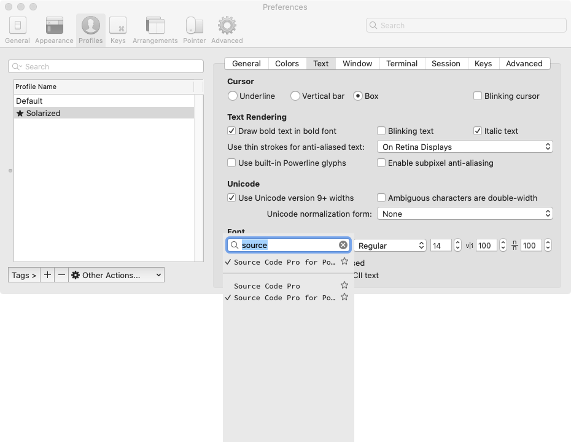

# dotfiles

### Things to backup

- project files
- ssh keys, aws, kubectl, k9s, gradle configurations
- docker images, database connections
- saved database queries

### Recovery flow

- Install xcode command line tools
```bash
$ sudo xcode-select --install
```

- Copy files from the backup, including ssh keys

- Make git to use ssh
```bash
$ eval "$(ssh-agent -s)"
$ ssh-add -K ~/.ssh/id_rsa
```

- Clone the repo & run the script
```bash
$ git clone git@github.com:appkr/dotfiles.git
$ bash bootstrap.sh
```

### Trouble shooting

Q. If the following message appears, when running iterm
```bash
[oh-my-zsh] Insecure completion-dependent directories detected:
drwxrwxr-x   7 juwon.kim  admin  224 10  5 21:31 /usr/local/share/zsh
drwxrwxr-x  10 juwon.kim  admin  320 10  5 21:36 /usr/local/share/zsh/site-functions
```
A. Change the permission of the dirs
```bash
$ chmod 755 /usr/local/share/zsh /usr/local/share/zsh/site-functions
```

Q. If the iterm prompt is broken like the following
```bash
~/dotfiles   master 
```
A. Change the font and its size


### IntelliJ plugins to install

#### Tools
- GraphQL: GraphQL language support including tagged template literals in JavaScript and TypeScript. Formerly known as JS GraphQL.
- PlantUML Integration: PlantUML diagramming tool integration. Now better and faster, with code navigation and highlighting.\
- Presentation Assistant: This plugin shows name and Win/Mac shortcuts of any action you invoke
- SequenceDiagram: SequenceDiagram for IntelliJ IDEA https://vanco.github.io/SequencePlugin.
- SpotBugs: IntelliJ SpotBugs plugin provides static byte code analysis to look for bugs in Java code from within IntelliJ IDEA.

#### Language support
- Python: The Python plug-in provides smart editing for Python scripts. The feature set of the plugin corresponds to PyCharm IDE Professional Edition.
- Ruby: Adds support for Ruby and Ruby on Rails.
- Scala: Adds support for the Scala language.
- Go: This plugin extends IntelliJ IDEA Ultimate with Go-specific coding assistance and tool integrations, and has everything you could find in GoLand.
- PHP: PHP 5.3-8.1 editing and debugging, PHPUnit, Smarty, Twig and various frameworks support
- PHP Annotations: Extends PhpStorm to support annotations in DocBlocks
- Symfony Support: Support for Symfony framework / components.
- Twig: Provides Twig Template Language support
- Vue.js: Support for Vue.js projects.

